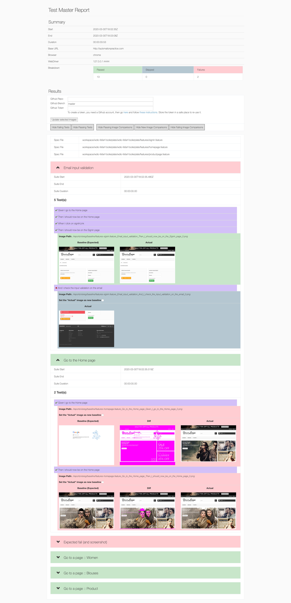

# wdio-fefanf-html-visreg-reporter
A reporter for webdriver.io which generates a HTML report for visual regression tests using [wdio-image-comparison-service](https://www.npmjs.com/package/wdio-image-comparison-service) in the [wdio-fefanf-boilerplate](https://github.com/aruiz-caritsqa/wdio-fefanf-boilerplate)

This project is a fork of [@rpii/wdio-html-reporter](https://www.npmjs.com/package/@rpii/wdio-html-reporter), which was itself a fork of a reporter I had previously created [wdio-html-format-reporter](https://www.npmjs.com/package/wdio-html-format-reporter)


## Installation

The easiest way is to keep the `wdio-fefanf-html-visreg-reporter` as a devDependency in your package.json:

```javascript
{
  "devDependencies": {
    "wdio-fefanf-html-visreg-reporter": "~0.0.2"
  }
}
```

Or, you can simply do it with:

```
npm install wdio-fefanf-html-visreg-reporter --save-dev
```

## Automatic PR with new baseline images
By selecting the images you want to become the new basline, and clicking "Update Selected Images", a Pull-Request will automatically be created in github on the repo you specify. You will need a github token.
	
To create a token, you need a Github account, then go [here](https://github.com/settings/tokens) and follow [these instructions](https://help.github.com/en/github/authenticating-to-github/creating-a-personal-access-token-for-the-command-line). Store the token in a safe place to re-use it.

## Configuration
The following code shows the default wdio test runner configuration. Just add an VisRegHtmlReporter object as another reporter to the reporters array.  Syntax shown requires babel:

```javascript
// wdio.conf.js
import { VisRegReportAggregator, VisRegHtmlReporter} from 'wdio-fefanf-html-visreg-reporter' ;
module.exports = {

  
  reporters: ['spec',
        [VisRegHtmlReporter, {
            debug: true,
            outputDir: './reports/visreg-reports/',
            filename: 'report.html',
            reportTitle: 'Visual Regression Test Report Title',
            // to override the git repo & branch
            gitRepo: '<owner>/<repo>', 
            // to show the report in a browser when done
            showInBrowser: true,

            // to use the template override option, can point to your own file in the test project:
            // templateFilename: path.resolve(__dirname, '../src/wdio-fefanf-html-visreg-reporter-alt-template.hbs'),
            
            // to add custom template functions for your custom template:
            // templateFuncs: {
            //     addOne: (v) => {
            //         return v+1;
            //     },
            // },

            //to initialize the logger
            LOG: log4j.getLogger("default")
        }
        ]
    ]
    
 
};
```
## Configuration Options:
  
### To generate a master report for all suites

webdriver.io will call the reporter for each test suite.  It does not aggregate the reports.  To do this, add the following event handlers to your wdio.config.js

```javascript
    onPrepare: function (config, capabilities) {

        let reportAggregator = new VisRegReportAggregator({
            outputDir: './reports/visreg-reports/',
            filename: 'master-report.html',
            reportTitle: 'Visual Regression Master Report',
            
            // to use the template override option, can point to your own file in the test project:
            // templateFilename: path.resolve(__dirname, '../src/wdio-fefanf-html-visreg-reporter-alt-template.hbs')
        });
        reportAggregator.clean() ;

        global.reportAggregator = reportAggregator;
    },
    
    onComplete: function(exitCode, config, capabilities, results) {
        (async () => {
            await global.reportAggregator.createReport( {
                config: config,
                capabilities: capabilities,
                results : results
            });
        })();
    },
    
``` 
### To use a logger for debugging

A new feature for developers is to add a log4js logger to see detailed debug output.  See the test/reporter.spec.js for configuration options
 
  
### To use a custom handlebars template for reports

Uncomment the templateFilename above, and in the VisRegReportAggregator.  You must provide an absolute path to the file you can modify the alt-template above if you wish
The template must support all the constructs in the default template.  YOu may add more or just change the formatting and css.

### To trigger visual regression tests
You just need to use [wdio-fefanf-boilerplate](https://github.com/aruiz-caritsqa/wdio-fefanf-boilerplate) and use the `@visreg` tag for specific Scenarios

```javascript
  @visreg
  Scenario: Go to the Home page
    Given I go to the Home page
    Then I should now be on the Home page
    When I click on signInLink
    Then I should now be on the Signin page
    ...

```

## Sample Output:


